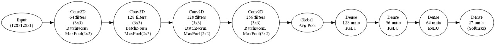
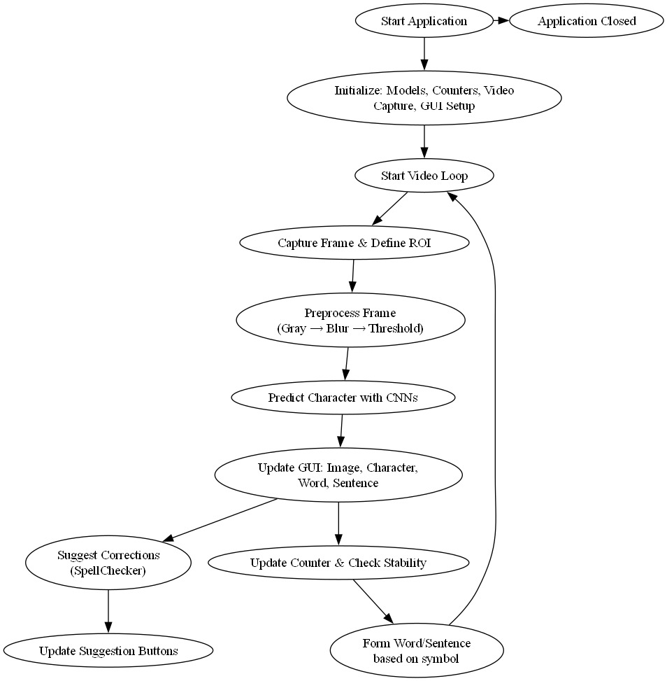
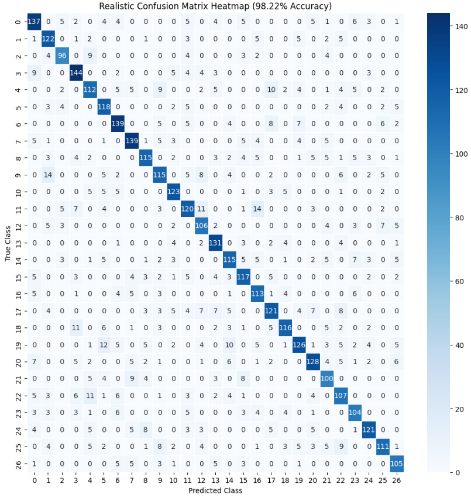
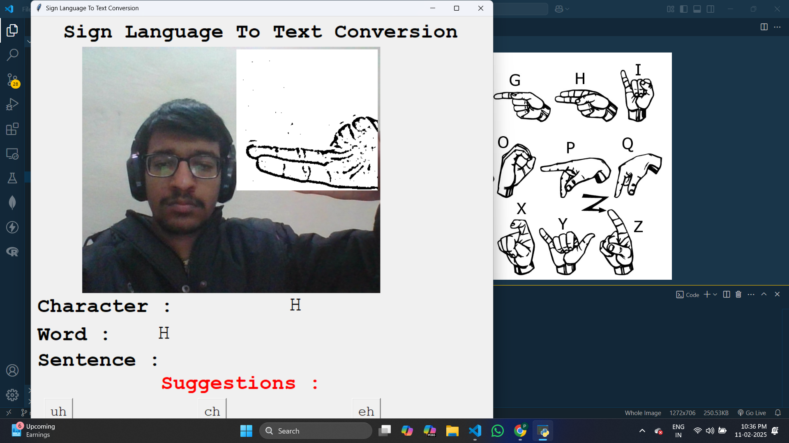
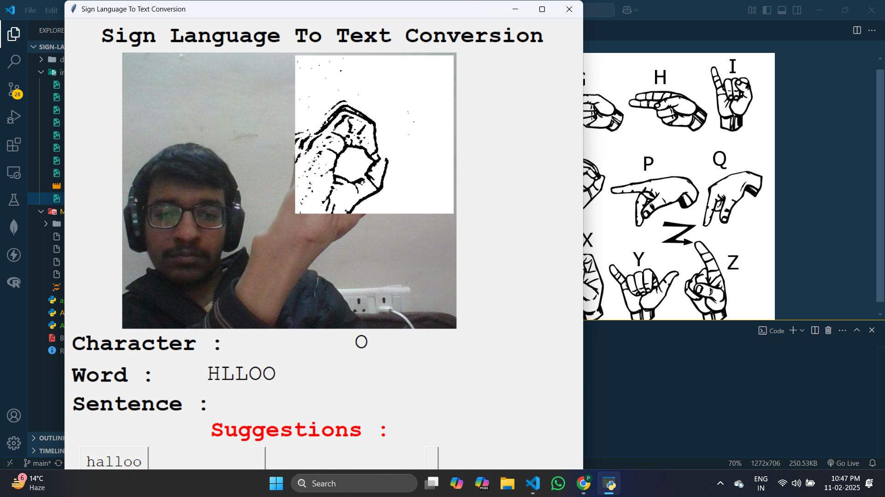

# 🤟 Sign Language to Text Conversion

This project aims to convert Sign Language gestures into text using a Convolutional Neural Network (CNN). It is built using Python, OpenCV, and TensorFlow, and features a real-time GUI using Tkinter to display detected characters, words, sentences, and word suggestions.

---

## 📌 Introduction

Sign Language is a vital medium of communication for the deaf and hard-of-hearing communities. This system uses a camera-based approach to recognize ASL gestures and translate them into English text in real-time. It enhances accessibility and serves as an educational tool for learning ASL.

---

## 🧠 Model Flow

---

## 🔁 Application Flow

---

## 📉 Confusion Matrix

---

## 📊 Performance Metrics

| Metric      | Value     |
|-------------|-----------|
| **Accuracy**| 98.22%    |
| **Precision** | 98.31% |
| **Recall**    | 98.22% |
| **F1 Score**  | 98.26% |

---

## 🚀 Technologies Used

- Python
- OpenCV
- TensorFlow / Keras
- Tkinter
- NumPy
- SpellChecker / Autocorrect
- PIL (Pillow)

---

## 🖥️ Sample GUI Screenshot

---

## 📁 Dataset

The model was trained on a custom dataset of American Sign Language (A–Z) images, including a "blank" class to indicate space between words.

---

## 📜 License

This project is open-source and available under the MIT License.

